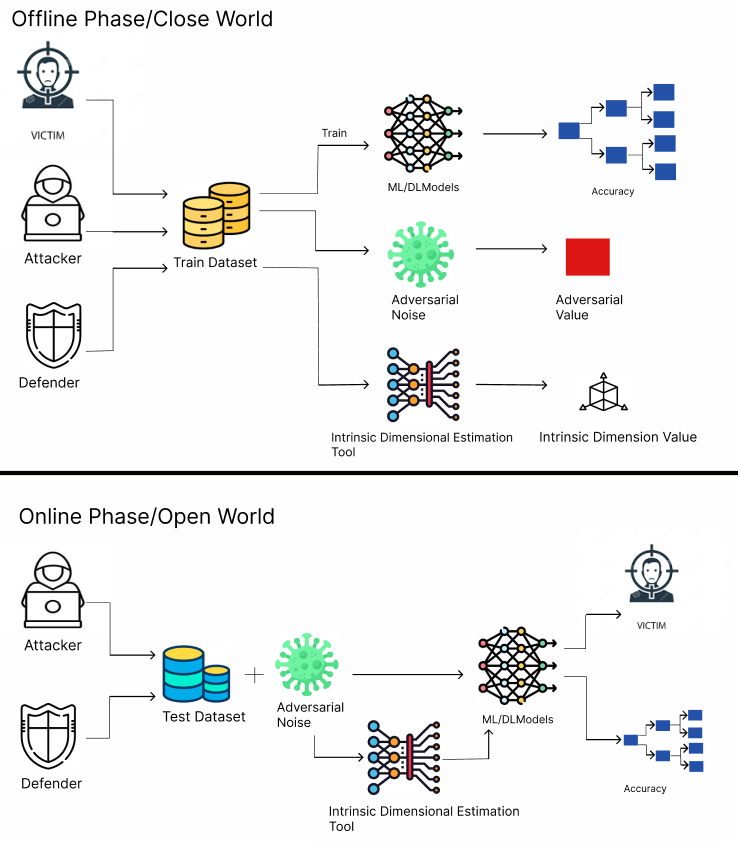

# DimShield
In this work, we propose DimShield, a novel framework that enhances model robustness by leveraging Intrinsic Dimension (ID) estimation. DimShield determines the most informative features in a dataset while effectively filtering out adversarial noise by systemically optimizing the latent space in Autoencoders utilizing reconstruction error (MSE) and classification accuracy. 

We evaluate our approach on benchmark datasets, including MNIST, CIFAR-10, and Olivetti Faces, under both Fast Gradient Sign Method (FGSM) and Basic Iterative Method (BIM) attacks. Our experiment demonstrates that \system restores up to 94\% accuracy in MNIST under BIM attacks while achieving high recovery accuracy on other datasets. These results highlight ID-based defenses as a promising direction for countermeasures against adversarial threats in machine learning and reliable deployment of machine learning systems in safety-critical applications.

## Threat Model
<p align="center">
  
</p>

## Implementation
DimShield has been tested across four different adversarial attacks for three open source datasets. 

```bash
├── BIM                     # Adversarial Attak
    ├── CIFAR10
    ├── MNIST
    ├── OLIVETTI
├── FGSM                    # Adversarial Attak
    ├── CIFAR10
    ├── MNIST
    ├── OLIVETTI
├── JSMA                    # Adversarial Attak
    ├── CIFAR10
    ├── MNIST
    ├── OLIVETTI
├── C\&W                    # Adversarial Attak
    ├── CIFAR10
    ├── MNIST
    ├── OLIVETTI
├── CNN                     # Base Model 
    ├── CIFAR10
    ├── MNIST
    ├── OLIVETTI
├── ID_Estimation           # Estimating Intrinsic Dimension 
    ├── CIFAR10
    ├── MNIST
    ├── OLIVETTI
├── DimShield               # DimShield Code to Mitigate Adversarial Attacks
    ├── CIFAR10
    ├── MNIST
    ├── OLIVETTI
```
